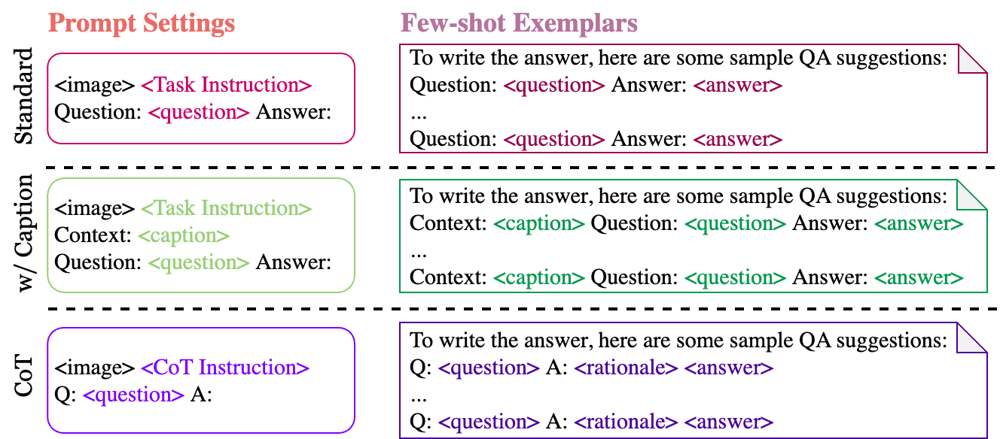
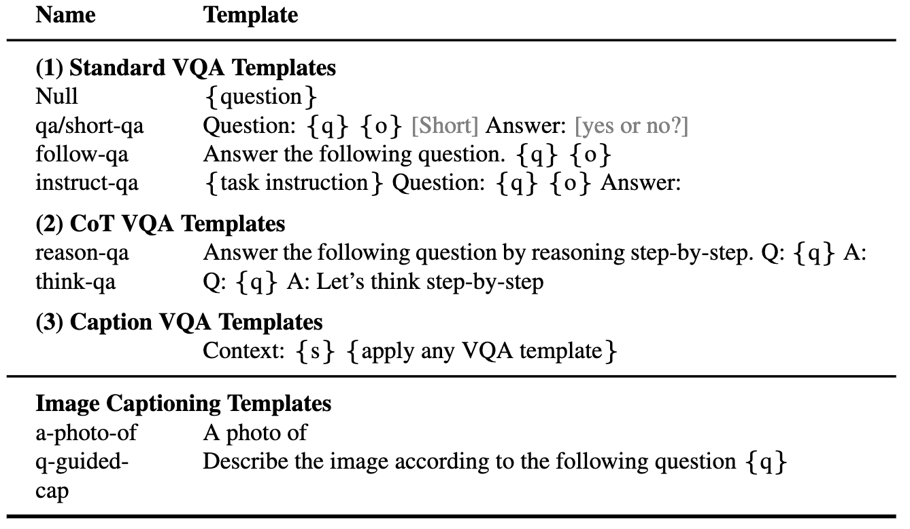

# Investigating Prompting Techniques for Zero- and Few-Shot Visual Question Answering

[Rabiul Awal](https://rabiul.me/), [Le Zhang](https://mila.quebec/en/person/le-zhang/) and [Aishwarya Agrawal](https://www.iro.umontreal.ca/~agrawal/)

<a href='https://rabiul.me/vqazero/'></a>  <a href='https://arxiv.org/abs/2306.09996'></a>



## Table of Contents
- [Installation](#installation)
- [Approach](#approach)
  * [VQA Formats](#vqa-formats)
  * [Prompt Templates](#prompt-templates)
- [Datasets](#datasets)
- [Usage](#usage)
  * [Running the inference code](#running-the-inference-code)
  * [Running Vicuna answer extraction](#running-vicuna-answer-extraction)
- [Results](#results)
- [Citing](#citing)
- [Acknowledgments](#acknowledgments)

## Approach

We explore fine-tuning-free prompting techniques applied to vision-language models, specifically state-of-the-art [BLIP2](https://arxiv.org/abs/2301.12597), [Kosmos2](https://arxiv.org/abs/2306.14824), [OpenFlamino](https://github.com/mlfoundations/open_flamingo) and multimodal instruction-tuned [LLaVa](https://llava-vl.github.io/). We mainly focus on the following prompting approaches:

- Zero- and few-shot prompt templates (commonly explored in NLP).
- Chain-of-thought reasoning for VQA.
- A two-step VQA method, proposing captioning as additional visual context for VLMs.


Existing vision-language models (VLMs) already show good zero-shot VQA performance. Our prompting techniques (especially captioning in few-shot vqa)lead to a substantial performance increase across benchmarks. However, though instruction-tuned models are claimed to show strong reasoning abilities, our tests found these reasoning abilities, particularly the chain-of-thought, to be deficient in diverse benchmarks. We hope our work will inspire future research in this direction.


### VQA Formats
We supports the following VQA formats:

| **Format** | **Description** | **Example** |
|------------|-----------------|-------------|
| **Standard VQA** | Standard VQA task format. | **Question**: "What is the primary activity of the people in the scene?"<br>**Answer**: "Dancing" |
| **Caption VQA** | Begins with a model-generated caption, then standard VQA format. | **Context**: A group of people in traditional attire are dancing around a bonfire.<br>**Question**: "What is the primary activity of the people in the scene?"<br>**Answer**: "Dancing" |
| **Chain-of-thought VQA** | Implements the chain-of-thought format. | **Question**: "What is the primary activity of the people in the scene? Let's think step-by-step."<br>**Answer**: "First, considering there's a bonfire, this often signifies a gathering or festivity. Next, seeing people in traditional attire implies a cultural event. Merging these observations, the primary activity is dancing around the bonfire." |


### Prompt Templates
We have a list of prompt templates that can be used with different VQA formats. Please check the `prompts/templates/{dataset_name}`.




## Datasets
Download and unzip the files into the `dataset/` folder for the VQA datasets. For **Winoground**, use the Hugging Face `datasets` library.

|           | OK-VQA | AOK-VQA | GQA | Winoground | VQAv2 |
|-----------|--------|---------|-----|------------|-------|
| **Source** | [allenai](https://okvqa.allenai.org/) | [allenai](https://allenai.org/project/a-okvqa/home) | [Stanford](https://cs.stanford.edu/people/dorarad/gqa/download.html) | [Hugging Face](https://huggingface.co/docs/datasets/index) | [VQA](https://visualqa.org/download.html) |


## Usage

### Running the inference code
To run the Standard VQA, use the following command:
```
python3 main.py --dataset_name okvqa \
  --model_name blip2_t5_flant5xxl \
  --vqa_format standard_vqa \
  --prompt_name prefix_your_task_knowledge_qa_short_answer
``` 
To run the Caption VQA, use the following command:
```
python3 main.py --dataset_name okvqa \
  --model_name blip2_t5_flant5xxl \
  --vqa_format caption_vqa \
  --prompt_name prefix_your_task_knowledge_qa_short_answer,prefix_promptcap
```

To run the Chain-of-thought VQA, use the following command:
```
python3 main.py --dataset_name okvqa \
  --model_name blip2_t5_flant5xxl \
  --vqa_format cot_vqa \
  --prompt_name prefix_think_step_by_step_rationale
```

### Running few-shot inference
Please prepare examplar dataset `dataset_zoo/nearest_neighbor.py` and run the following command:
```
python3 main.py \
  --dataset_name okvqa \
  --model_name blip2_t5_flant5xxl \
  --vqa_format standard_vqa \
  --prompt_name prefix_your_task_knowledge_qa_short_answer \
  --vicuna_ans_parser --few_shot
``` 

### Running Vicuna answer extraction
Considering the constraints of VQA accuracy metrics in the context of open-ended answer generation, we offer utility scripts in `evals/vicuna_llm_evals.py`. Using [Vicuna LLM](https://lmsys.org/blog/2023-03-30-vicuna/), these scripts process generated answers to align with reference responses and subsequently evaluate them based on the conventional VQA metric.
 
```
python3 main.py \
  --dataset_name okvqa \
  --model_name blip2_t5_flant5xxl \
  --vqa_format standard_vqa \
  --prompt_name prefix_your_task_knowledge_qa_short_answer \
  --vicuna_ans_parser
``` 

## Results
We report the baseline and best setting results. Please check the paper for more results.

#### OKVQA

|             | **BLIP2 Flan-T5** | **BLIP2 OPT** | **Kosmos2** | **OpenFlamingo** | **LLaVA** |
|-------------|-------------------|---------------|-------------|------------------|----------|
| **Baseline**| 50.13             | 42.7         | 40.33        |       18.29        | 44.84    |
| **Best**    | 50.55             | 46.29        | 43.09        |         42.48      | 46.86    |


#### AOKVQA

|             | **BLIP2 Flan-T5** | **BLIP2 OPT** | **Kosmos2** | **OpenFlamingo** | **LLaVA** |
|-------------|-------------------|---------------|-------------|------------------|----------|
| **Baseline**| 51.20             | 45.57         | 40.85       |        17.27        | 52.69   |
| **Best**    | 54.98             | 49.39         | 43.60      |       44.13         | 52.32   |


#### GQA

|             | **BLIP2 Flan-T5** | **BLIP2 OPT** | **Kosmos2** | **OpenFlamingo** | **LLaVA** |
|-------------|-------------------|---------------|-------------|------------------|----------|
| **Baseline**| 44.46             | 38.46         | 37.33       |     26.37        | 38.40    |
| **Best**    | 47.01             | 41.99         | 40.13       |     41.00        | 42.65    |
 

#### VQAv2

|             | **BLIP2 Flan-T5** | **BLIP2 OPT** | **Kosmos2** | **OpenFlamingo** | **LLaVA** |
|-------------|-------------------|---------------|-------------|------------------|----------|
| **Baseline**|    66.66     |      54.53    |    53.52     |         35.41     |   56.2    |
| **Best**    |    71.37     |      62.81    |    57.33     |         58.0      |  65.32    |


## Citing
Please email `rabiul.awal [at] mila [dot] quebec` for any questions. You can also open an issue or pull request to add more prompting techniques or new multi-modal vision-language models.

If you find this code useful, please cite our paper:
```
@article{awal2023investigating,
  title={Investigating Prompting Techniques for Zero-and Few-Shot Visual Question Answering},
  author={Awal, Rabiul and Zhang, Le and Agrawal, Aishwarya},
  journal={arXiv preprint arXiv:2306.09996},
  year={2023}
}
```

## Acknowledgments
The codebase is build on top of [transformers](https://github.com/huggingface/transformers), [lavis](https://github.com/salesforce/LAVIS), [llava](https://github.com/haotian-liu/LLaVA) and [fastchat](https://github.com/lm-sys/FastChat) repositories. We thank the authors for their amazing work.