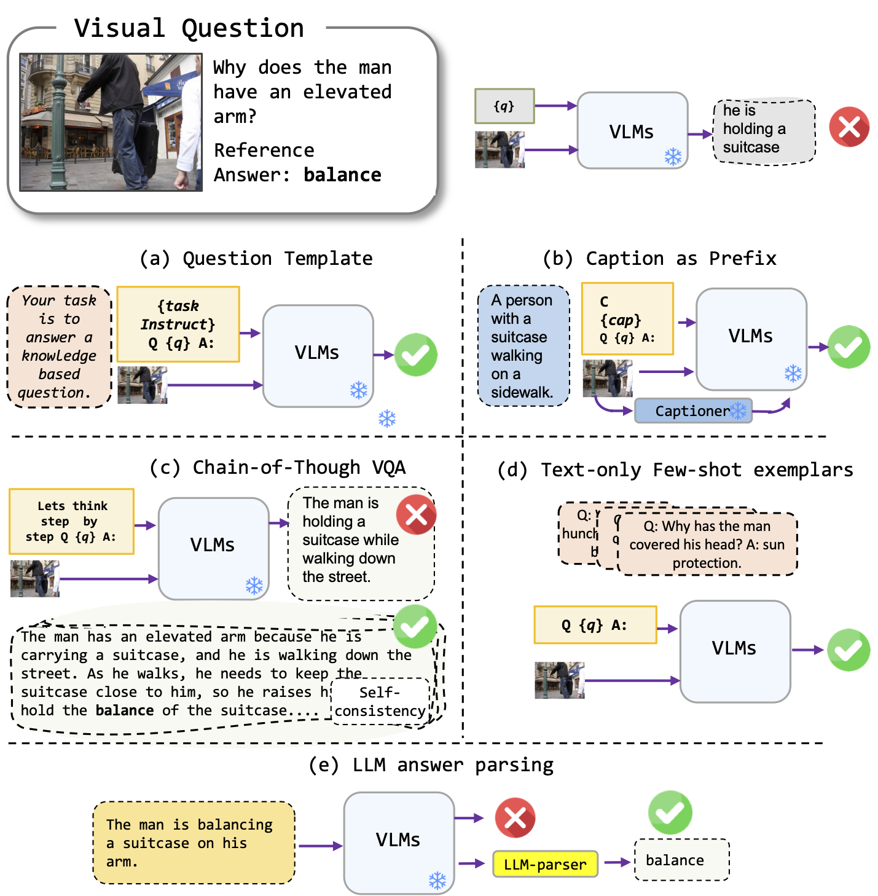
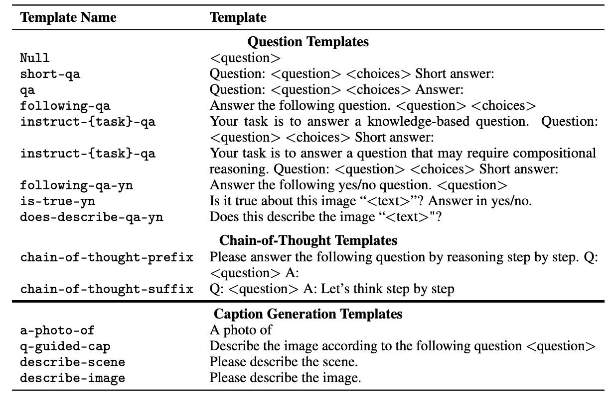

# Investigating Prompting Techniques for Zero- and Few-Shot Visual Question Answering


This codebase contains the code for the paper [Investigating Prompting Techniques for Zero- and Few-Shot Visual Question Answering](https://arxiv.org/abs/2109.05281).




## VQA Formats
The project supports the following VQA formats:

- Standard VQA: Standard VQA task format.
- Caption VQA: Model-generated caption first and then applies standard VQA format.
- Chain-of-thought VQA: Chain-of-thought VQA format.

## Prompt Templates
We have a list of prompt templates that can be used with different VQA formats. Please check the `prompts/templates/{dataset_name}` for the list of templates.




## Datasets

- **OK-VQA** -  You can download the dataset from [allenai](https://okvqa.allenai.org/). Download files and put them and unzip in the folder `dataset/` folder.
- **AOK-VQA** -  You can download the dataset from [allenai](https://allenai.org/project/a-okvqa/home). Download files and put them and unzip in the folder `dataset/` folder.
- **GQA** - You can download the dataset from Stanford [website](https://cs.stanford.edu/people/dorarad/gqa/download.html). Download files and put them and unzip in the folder `dataset/` folder.
- **Winoground** -  The Winoground dataset can be used using the Hugging Face [datasets](https://huggingface.co/docs/datasets/index) library.

## Example Usage

To run the Standard VQA approach, you can use the following command:
```
python3 main_v2.py --dataset_name okvqa --model_name blip2_t5_flant5xxl --vqa_format basic_qa --prompt_name prefix_your_task_knowledge_qa_short_answer
``` 
To run the Caption VQA approach, you can use the following command:
```
python3 main_v2.py --dataset_name okvqa --model_name blip2_t5_flant5xxl --vqa_format caption_qa --prompt_name prefix_your_task_knowledge_qa_short_answer,prefix_promptcap
```

To run the Chain-of-thought VQA approach, you can use the following command:
```
python3 main_v2.py --dataset_name okvqa --model_name blip2_t5_flant5xxl --vqa_format cot_qa --prompt_name prefix_think_step_by_step_rationale
```


## Citation
If you find this code useful, please cite our paper:
```
@article{awal2023investigating,
  title={Investigating Prompting Techniques for Zero-and Few-Shot Visual Question Answering},
  author={Awal, Rabiul and Zhang, Le and Agrawal, Aishwarya},
  journal={arXiv preprint arXiv:2306.09996},
  year={2023}
}
```